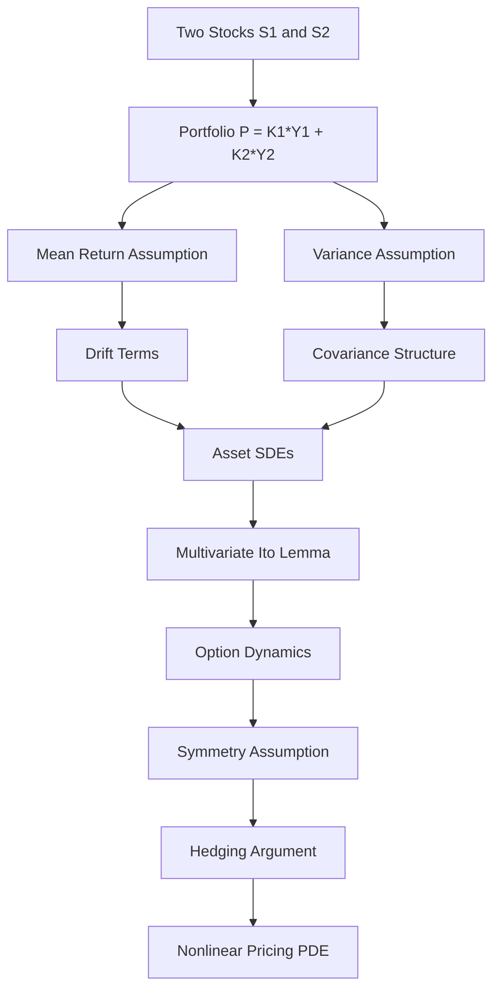

# A Two-Asset Extension of the Black–Scholes Derivation

## Motivation

After reading the original Black–Scholes paper, I wanted to gain a deeper understanding of option pricing by attempting a similar derivation in a multi-asset setting. Rather than considering a single stock, I model two underlying assets and investigate what happens when assumptions analogous to those used in Black–Scholes are imposed on a weighted portfolio of assets.

This work should be viewed as an exploratory mathematical exercise intended to improve understanding of stochastic calculus and option pricing rather than as a complete financial model.

---

# Derivation Roadmap

---

# Model Setup

Let $Y_1(t)$ and $Y_2(t)$ denote the prices of two stocks $S_1$ and $S_2$.

Define the weighted portfolio

$$
P = K_1Y_1 + K_2Y_2
$$

where $K_1$ and $K_2$ are constants.

The objective is to derive a pricing equation for options written on these assets using assumptions analogous to those employed in the Black–Scholes framework.
---
# Mean Return Assumption

Assume

$$
E\left(
\frac{dP}{P}
\right)=
\mu\.dt
$$

Using vector notation,

$$
K=
\left[
\begin{array}{c}
K_1\\
K_2
\end{array}
\right],
\qquad
Y=
\left[
\begin{array}{c}
Y_1\\
Y_2
\end{array}
\right],
$$

so that

$$
P = K^TY.
$$

The assumption becomes

$$
E\left(
\frac{K^TdY}{K^TY}
\right)=
\mu\.dt
$$

Hence

$$
K^TE(dY)=
K^TY\\mu\.dt
$$

Since this must hold for arbitrary choices of

$$
K,
$$

we obtain

$$
E(dY_1)=
\mu Y_1dt,
$$

and

$$
E(dY_2)=
\mu Y_2dt.
$$

Therefore the drift coefficients are

$$
a_1=\mu Y_1,
$$

$$
a_2=\mu Y_2.
$$

---

# Variance Assumption

Assume

$$
Var\\left(\frac{K^TdY}{K^TY}\right)=\sigma^2dt.
$$

Using

$$
Var(AX)=A\.Var(X)\.A^T
$$

gives

$$
\frac{K^TVar(dY)K}{(K^TY)^2}=
\sigma^2dt.
$$

Thus

$$
K^TVar(dY)K=
K^TYY^TK\\sigma^2dt.
$$

Since this must hold for arbitrary $K$,

$$
Var(dY)=YY^T\sigma^2dt.
$$

Equivalently,

$$
Var(dY)=
\sigma^2dt
\begin{pmatrix}
Y_1^2 & Y_1Y_2\\
Y_1Y_2 & Y_2^2
\end{pmatrix}.
$$

Therefore

$$
Var(dY_1)=\sigma^2Y_1^2dt,
$$

$$
Var(dY_2)=\sigma^2Y_2^2dt,
$$

and

$$ Cov(dY_1,dY_2)=\sigma^2Y_1Y_2dt $$

---

> **Observation**
>
> Although the underlying Brownian motions are assumed to be independent, the variance assumption imposed on the weighted portfolio implies
>
> $$
> Cov(dY_1,dY_2)
> => \sigma^2Y_1Y_2dt.
> $$
>
> Consequently, the asset price processes acquire a non-trivial covariance structure. This is one of the most interesting consequences of the modeling assumptions.

---

# Asset Dynamics

Assume

$$
dY_1=a_1(Y_1,Y_2,t)dt+b_1(Y_1,Y_2,t)dB_1+c_1(Y_1,Y_2,t)dB_2
$$

and

$$
dY_2=a_2(Y_1,Y_2,t)dt+b_2(Y_1,Y_2,t)dB_1+c_2(Y_1,Y_2,t)dB_2.
$$

 and we assume c_1=b_2
Using the covariance structure derived above,

$$
Y_1^2\sigma^2=b_1^2+b_2^2,
$$

$$
Y_2^2\sigma^2=c_1^2+c_2^2,
$$

and

$$
Y_1Y_2\sigma^2=b_1c_1+b_2c_2.
$$

Together with

$$
a_1=\mu Y_1,
\qquad
a_2=\mu Y_2,
$$

these equations characterize the admissible diffusion coefficients.
# Option Price Dynamics

Let $w(Y_1,Y_2,t)$ denote the option price associated with the first stock.

Applying multivariate Itô's lemma,

$$
dw=
\frac{\partial w}{\partial t}dt
+
\frac{\partial w}{\partial y_1}dY_1
+
\frac{\partial w}{\partial y_2}dY_2
+
\frac12\sigma^2Y_1^2\frac{\partial^2w}{\partial y_1^2}dt
+
\frac12\sigma^2Y_2^2\frac{\partial^2w}{\partial y_2^2}dt
+
\sigma^2Y_1Y_2\frac{\partial^2w}{\partial y_1\partial y_2}dt.
$$

---
# Symmetry Assumption

Assume the option pricing function is symmetric:

$$
w(Y_1,Y_2,t)
$$

represents the option price of stock

$$
S_1,
$$

while

$$
w(Y_2,Y_1,t)
$$

represents the option price of stock

$$
S_2.
$$

Thus a single function generates both option prices through interchange of arguments.

---

# Hedging Argument

Construct the portfolio

$$
\Pi=
K_1.Y_1+K_2.Y_2-
K_1w(Y_1,Y_2,t)-
K_2w(Y_2,Y_1,t).
$$

Following a Black–Scholes style hedging argument and imposing return neutrality leads to the nonlinear PDE

$$
\begin{aligned}
0={}&
\gamma
\left[
\left(\frac{\partial w}{\partial y_1}\right)^2-
\left(\frac{\partial w}{\partial y_2}\right)^2
\right]
(K_1y_1+K_2y_2)
\
&-\gamma
\frac{\partial w}{\partial y_1}
\left[
K_1w(y_1,y_2,t)+
K_2w(y_1,y_2,t)
\right]
\&+\gamma
\frac{\partial w}{\partial y_2}
\left[
K_2w(y_1,y_2,t)+
K_1w(y_2,y_1,t)
\right]
\&
+\frac{\sigma^2}{2}
(K_1y_1^2+K_2y_2^2)
\left(
\frac{\partial^2w}{\partial y_1^2}
\frac{\partial w}{\partial y_1}-
\frac{\partial^2w}{\partial y_2^2}
\frac{\partial w}{\partial y_2}
\right)
\
&-\frac{\sigma^2}{2}
(K_1y_2^2+K_2y_1^2)
\left(
\frac{\partial^2w}{\partial y_1^2}
\frac{\partial w}{\partial y_2}-
\frac{\partial^2w}{\partial y_2^2}
\frac{\partial w}{\partial y_1}
\right)
\
&+(K_1+K_2)\frac{\partial w}{\partial t}(\frac{\partial w}{\partial y_1}-\frac{\partial w}{\partial y_2})
\end{aligned}
$$

---

# Mathematical Structure

$$
\text{Portfolio Assumptions}
\Longrightarrow
\text{Covariance Structure}
\Longrightarrow
\text{Asset SDEs}
\Longrightarrow
\text{Ito Expansion}
\Longrightarrow
\text{Hedging}
\Longrightarrow
\text{Pricing PDE}
$$

---

# Conclusion

This project began as an attempt to better understand the ideas underlying the Black–Scholes derivation by extending the argument to a simple two-asset setting. Starting from assumptions on the mean and variance of returns of a weighted portfolio, I derived the implied covariance structure, constructed stochastic differential equations for the underlying assets, and applied multivariate Itô calculus together with a hedging argument to obtain a nonlinear pricing PDE.

While I still have a great deal to learn in stochastic calculus—particularly the deeper mathematical foundations and derivation of Itô's lemma—this exercise was extremely valuable. It provided practical experience in applying various forms of the chain rule, including multivariate extensions, working with covariance matrices, constructing stochastic differential equations, and understanding how hedging arguments transform stochastic dynamics into deterministic partial differential equations.

More importantly, the exercise highlighted how much of option pricing theory is built from a careful combination of probability, differential calculus, and financial reasoning. Even if the resulting PDE does not correspond to a practical pricing model, the process of deriving it proved to be an excellent learning experience and provided a deeper appreciation for the structure of the Black–Scholes framework.

---

# Future Directions

- Study rigorous derivations of Itô's lemma and stochastic integrals.
- Extend the model to correlated Brownian motions.
- Investigate arbitrage-freeness of the framework.
- Analyze the nonlinear PDE and its mathematical properties.
- Explore appropriate terminal and boundary conditions.
- Develop finite-difference and Monte Carlo solution methods.
- Compare the derivation with established multi-asset Black–Scholes models.
- Investigate the existence of an equivalent risk-neutral measure.

---

# Disclaimer

This work was carried out as a personal learning exercise inspired by the original Black–Scholes paper. The derivation is exploratory and should not be interpreted as a validated financial pricing model. Its primary purpose is to deepen understanding of stochastic calculus, option pricing, and multidimensional extensions of classical financial models.
