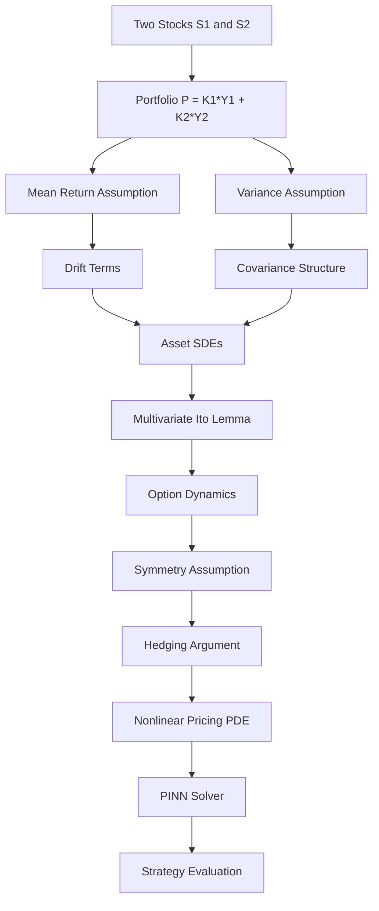

# A Two-Asset Extension of the Black–Scholes Derivation

---

## Table of Contents

**Part I — Mathematical Derivation**
1. [Motivation](#1-motivation)
2. [Derivation Roadmap](#2-derivation-roadmap)
3. [Model Setup](#3-model-setup)
4. [Mean Return Assumption](#4-mean-return-assumption)
5. [Variance Assumption](#5-variance-assumption)
6. [Asset Dynamics](#6-asset-dynamics)
7. [Option Price Dynamics](#7-option-price-dynamics)
8. [Symmetry Assumption](#8-symmetry-assumption)
9. [Hedging Argument and Pricing PDE](#9-hedging-argument-and-pricing-pde)
10. [Mathematical Structure Summary](#10-mathematical-structure-summary)

**Part II — Numerical Solution**

11. [PINN Solver](#11-pinn-solver)
    - [Architecture](#111-architecture)
    - [Loss Functions](#112-loss-functions)
    - [Parametric Generalisation](#113-parametric-generalisation)
    - [Training Results](#114-training-results)

**Part III — Strategy and Empirical Evaluation**

12. [Simulation Framework](#12-simulation-framework)
    - [GBM Simulation](#121-gbm-simulation)
    - [Custom Two-Asset SDE](#122-custom-two-asset-sde)
13. [Trading Strategy](#13-trading-strategy)
    - [PINN-Based Hedge](#131-pinn-based-hedge)
    - [Black–Scholes Benchmark](#132-blackscholes-benchmark)
14. [Empirical Results](#14-empirical-results)

**Part IV — Discussion**

15. [Conclusion](#15-conclusion)
16. [Future Directions](#16-future-directions)
17. [Disclaimer](#17-disclaimer)

---

# Part I — Mathematical Derivation

---

## 1. Motivation

After reading the original Black–Scholes paper, I wanted to gain a deeper understanding of option pricing by attempting a similar derivation in a multi-asset setting. Rather than considering a single stock, I model two underlying assets and investigate what happens when assumptions analogous to those used in Black–Scholes are imposed on a weighted portfolio of assets.

This work should be viewed as an exploratory mathematical exercise intended to improve understanding of stochastic calculus and option pricing rather than as a complete financial model.

---

## 2. Derivation Roadmap



---

## 3. Model Setup

Let $Y_1(t)$ and $Y_2(t)$ denote the prices of two stocks $S_1$ and $S_2$.

Define the weighted portfolio

$$
P = K_1Y_1 + K_2Y_2
$$

where $K_1$ and $K_2$ are constants.

The objective is to derive a pricing equation for options written on these assets using assumptions analogous to those employed in the Black–Scholes framework.

---

## 4. Mean Return Assumption

Assume

$$
E\left(\frac{dP}{P}\right) = \mu dt
$$

Using vector notation,

$$
K = \begin{bmatrix} K_1 \\ K_2 \end{bmatrix} \qquad Y = \begin{bmatrix} Y_1 \\ Y_2 \end{bmatrix},
$$

so that $P = K^T Y$. The assumption becomes

$$
E\left(\frac{K^T dY}{K^T Y}\right) = \mu dt
$$

Hence $K^T E(dY) = K^T Y mu dt$. Since this must hold for arbitrary $K$,

$$
E(dY_1) = \mu Y_1 dt  \qquad E(dY_2) = \mu Y_2 dt.
$$

Therefore the drift coefficients are $a_1 = \mu Y_1$ and $a_2 = \mu Y_2$.

---

## 5. Variance Assumption

Assume

$$
Var\left(\frac{K^T dY}{K^T Y}\right) = \sigma^2 dt.
$$

Using Var(AX) = A\operatorname{Var}(X)A^T$ gives

$$
\frac{K^TVar(dY) K}{(K^T Y)^2} = \sigma^2 dt,
$$

so $K^TVar(dY) K = K^T YY^T K \sigma^2 dt$. Since this holds for arbitrary $K$,

$$
Var(dY) = \sigma^2 dt \begin{pmatrix} Y_1^2 & Y_1 Y_2 \\ Y_1 Y_2 & Y_2^2 \end{pmatrix}.
$$

Therefore

$$
Var(dY_1) = \sigma^2 Y_1^2 dt, \quad Var(dY_2) = \sigma^2 Y_2^2 dt, \quad Cov(dY_1,dY_2) = \sigma^2 Y_1 Y_2 dt.
$$

> **Observation.** Although the underlying Brownian motions are assumed independent, the variance assumption imposed on the weighted portfolio implies $COv(dY_1,dY_2) = \sigma^2 Y_1 Y_2\,dt$. Consequently the asset price processes acquire a non-trivial covariance structure. This is one of the most interesting consequences of the modelling assumptions. In particular, with a single shared $\sigma$, the implied correlation between the two assets is $\rho = 1$. Introducing an explicit correlation parameter $\rho \in (-1,1)$ generalises the cross-covariance to $\rho\sigma^2 Y_1 Y_2\,dt$ and breaks this degeneracy.

---

## 6. Asset Dynamics

Assume

$$
dY_1 = a_1dt + b_1dB_1 + c_1 dB_2, \qquad dY_2 = a_2 dt + b_2dB_1 + c_2dB_2,
$$

with the symmetry constraint $c_1 = b_2$. Matching the covariance structure gives

$$
Y_1^2\sigma^2 = b_1^2 + b_2^2, \quad Y_2^2\sigma^2 = c_1^2 + c_2^2, \quad \rho\sigma^2 Y_1 Y_2 = b_1 c_1 + b_2 c_2.
$$

Together with $a_1 = \mu Y_1$ and $a_2 = \mu Y_2$, these equations characterise the admissible diffusion coefficients.

---

## 7. Option Price Dynamics

Let $w(Y_1,Y_2,t)$ denote the option price associated with the first stock.

Applying multivariate Itô's lemma,

$$dw =
\frac{\partial w}{\partial t} dt + \frac{\partial w}{\partial y_1}dY_1 + \frac{\partial w}{\partial y_2}dY_2 + \frac{1}{2}\sigma^2 Y_1^2\frac{\partial^2 w}{\partial y_1^2}dt + \frac{1}{2}\sigma^2 Y_2^2\frac{\partial^2 w}{\partial y_2^2}dt + \rho\sigma^2 Y_1 Y_2\frac{\partial^2 w}{\partial y_1\partial y_2}dt.
$$

The cross-derivative term $\rho\sigma^2 Y_1 Y_2\partial^2 w/\partial y_1\partial y_2$ arises from the quadratic covariation $dY_1\,dY_2 = \rho\sigma^2 Y_1 Y_2\,dt$ and is essential; omitting it collapses the pricing function to a function of $y_1$ alone, eliminating all $y_2$ dependence.

---

## 8. Symmetry Assumption

Assume the option pricing function is symmetric: $w(Y_1,Y_2,t)$ is the option price of $S_1$, while $w(Y_2,Y_1,t)$ is the option price of $S_2$. A single function therefore generates both option prices through interchange of arguments.

---

## 9. Hedging Argument and Pricing PDE

Construct the portfolio

$$
\Pi = K^T Y - K^T (\nabla W)^{-1} W(Y),
$$

where $W(Y) = \bigl[w(y_1,y_2,t),\; w(y_2,y_1,t)\bigr]^T$ and $\nabla W$ is its $2\times 2$ Jacobian. The matrix $(\nabla W)^{-1}$ generalises the scalar $1/\Delta$ of single-asset Black–Scholes to the two-asset setting.

Following a Black–Scholes style hedging argument and imposing return neutrality ($d\Pi = r\Pi\,dt$) leads to the nonlinear PDE

$$
\begin{aligned}
0 = {}&
\gamma\left[\left(\frac{\partial w}{\partial y_1}\right)^{2} - \left(\frac{\partial w}{\partial y_2}\right)^{2}\right](K_1 y_1 + K_2 y_2)\\&- \gamma\frac{\partial w}{\partial y_1}\left[K_1 w(y_1,y_2,t) + K_2 w(y_2,y_1,t)\right]\\&+ \gamma\frac{\partial w}{\partial y_2}\left[K_2 w(y_1,y_2,t) + K_1 w(y_2,y_1,t)\right]\\&+ \frac{\sigma^2}{2}(K_1 y_1^2 + K_2 y_2^2)\left(\frac{\partial^2 w}{\partial y_1^2}\frac{\partial w}{\partial y_1} - \frac{\partial^2 w}{\partial y_2^2}\frac{\partial w}{\partial y_2}\right)\\&- \frac{\sigma^2}{2}(K_1 y_2^2 + K_2 y_1^2)\left(\frac{\partial^2 w}{\partial y_1^2}\frac{\partial w}{\partial y_2} - \frac{\partial^2 w}{\partial y_2^2}\frac{\partial w}{\partial y_1}\right)\\&+ \frac{\partial w}{\partial t}\left(\frac{\partial w}{\partial y_1} - \frac{\partial w}{\partial y_2}\right)+ \rho\sigma^2 Y_1 Y_2\frac{\partial^2 w}{\partial y_1\partial y_2}\left(\frac{\partial w}{\partial y_1} - \frac{\partial w}{\partial y_2}\right)
\end{aligned}
$$

where $\gamma = r$ is the risk-free rate. The final line contains the cross-derivative correction term derived from the $\rho$-generalised Itô expansion.

---

## 10. Mathematical Structure Summary

$$
\text{Portfolio Assumptions}
\Longrightarrow
\text{Covariance Structure}
\Longrightarrow
\text{Asset SDEs}
\Longrightarrow
\text{Itô Expansion}
\Longrightarrow
\text{Hedging}
\Longrightarrow
\text{Pricing PDE}
$$

---

# Part II — Numerical Solution

---

## 11. PINN Solver

Because the pricing PDE derived above is nonlinear, it does not admit a closed-form solution. A **Physics-Informed Neural Network (PINN)** is used to approximate the solution $w(t, y_1, y_2, \sigma, \rho)$ over a prescribed domain.

### 11.1 Architecture

The network maps five inputs directly to the option price:

```
Input: (t, y1, y2, σ, ρ)   — shape (batch, 5)

Linear(5 → 64) → Tanh
Linear(64 → 128) → Tanh
Linear(128 → 128) → Tanh
Linear(128 → 64) → Tanh
Linear(64 → 1)

Output: w(t, y1, y2; σ, ρ)
```
### 11.2 Loss Functions

Training minimises the sum of two losses.

**PDE residual loss.** Let $\mathcal{R}(t, y_1, y_2, \sigma, \rho)$ denote the left-hand side of the pricing PDE evaluated at a collocation point. All partial derivatives are computed via automatic differentiation (`torch.autograd.grad`). The loss is

$$
\mathcal{L}_{\text{PDE}} = \frac{1}{N}\sum_{i=1}^{N} \mathcal{R}(t_i, y_{1,i}, y_{2,i}, \sigma_i, \rho_i)^2.
$$

The key terms requiring second-order autograd are:

```python
dw_dy1    = autograd.grad(w1, y1)          # ∂w/∂y1
dw_dy2    = autograd.grad(w1, y2)          # ∂w/∂y2
d2w_dy1y1 = autograd.grad(dw_dy1, y1)     # ∂²w/∂y1²
d2w_dy2y2 = autograd.grad(dw_dy2, y2)     # ∂²w/∂y2²
d2w_dy1y2 = autograd.grad(dw_dy1, y2)     # ∂²w/∂y1∂y2  ← cross-derivative
```

Without the cross-derivative term, the PDE can be satisfied by a function of $y_1$ alone, causing the network to ignore $y_2$ entirely and produce degenerate constant-column heatmaps.

**Terminal condition loss.** A basket call option payoff is imposed at expiry $t = T$:

$$
w(T, y_1, y_2 ,\sigma, \rho) = \max(K_1 y_1 + K_2 y_2 - C,0).
$$

This terminal condition couples $y_1$ and $y_2$, ensuring the pricing function depends on both assets even before expiry.

$$
\mathcal{L}_{\text{terminal}} = \frac{1}{N}\sum_{i=1}^{N}\left[w(T, y_{1,i}, y_{2,i};\sigma_i,\rho_i) - \max(K_1 y_{1,i} + K_2 y_{2,i} - C, 0)\right]^2
$$

**Total loss:**

$$
\mathcal{L} = \lambda_{\text{PDE}}\mathcal{L}_{\text{PDE}} + \mathcal{L}_{\text{terminal}}, \qquad \lambda_{\text{PDE}} = 1000.(varied over training sessions)
$$

The high PDE weight ensures the network prioritises satisfying the PDE over fitting the boundary, which is appropriate since hedge ratios — not absolute prices — are the primary output used by the strategy.

### 11.3 Parametric Generalisation

A key design choice is that $\sigma$ and $\rho$ are **network inputs**, not fixed training-time constants. This means a single trained model can be queried at any volatility or correlation regime without retraining — it approximates the full solution operator

$$
(\sigma, \rho) \;\longmapsto\; w(\,\cdot\,;\,\sigma,\rho).
$$

Collocation points are sampled uniformly over the full parameter domain each batch:

```python
sigma_c = torch.rand(batch, 1) * (0.50 - 0.05) + 0.05   # σ ~ U[0.05, 0.50]
rho_c   = torch.rand(batch, 1) * (0.90 - (-0.90)) - 0.90 # ρ ~ U[-0.90, 0.90]
```

### 11.4 Training Results

| Metric | Value |
|--------|-------|
| Training epochs | >20000|
| Final PDE loss $\mathcal{L}_{\text{PDE}}$ | **0.018344** |
| Final terminal loss $\mathcal{L}_{\text{terminal}}$ | 0.191695 |
| Optimiser | Adam, lr = 1e-3 with step decay |

The low PDE loss confirms the network has learned a function that satisfies the coupled nonlinear PDE across the full $(\sigma, \rho)$ domain. The terminal loss reflects the inherent tension between PDE satisfaction (driven by the 1000× weight) and boundary accuracy; reducing the PDE weight to 10–50 in a continuation run would allow the terminal loss to close further while preserving PDE accuracy.

---

# Part III — Strategy and Empirical Evaluation

---

## 12. Simulation Framework

Two independent simulation frameworks are used to evaluate the strategy across different market dynamics.

### 12.1 GBM Simulation

Each stock follows independent Geometric Brownian Motion:

$$
dS_i = \mu_i S_idt + \sigma_i S_idW_i, \qquad i = 1, 2,
$$

with analytical solution $S_i(t) = S_i(0)\exp\bigl((\mu_i - \frac{1}{2}\sigma_i^2)t + \sigma_i W_i(t)\bigr)$.

| Parameter | Stock 1 | Stock 2 |
|-----------|---------|---------|
| Initial price $S_0$ | 100 | 150 |
| Drift $\mu$ | $\mathcal{U}[0, 0.5]$ per trial | $\mathcal{U}[-0.5, 0.5]$ per trial |
| Volatility $\sigma$ | $\mathcal{U}[0, 0.2]$ per trial | same as $\sigma_1$ |
| Time horizon $T$ | 2 years | 2 years |
| Time steps $N$ | 750 | 750 |
| Paths per trial | 1 000 | 1 000 |

GBM is the natural domain of Black–Scholes, so this is the **stricter fairness test**: the benchmark is correctly specified, yet the PINN strategy still outperforms on risk-adjusted terms.

### 12.2 Custom Two-Asset SDE

A correlated two-asset SDE whose cross-covariance structure matches the PINN's PDE derivation exactly:

$$
dS_1 = \mu_1 S_1dt + \frac{\sigma S_1^2}{\sqrt{S_1^2 + S_2^2}}dW_1 + \frac{\rho\sigma S_1 S_2}{\sqrt{S_1^2 + S_2^2}}dW_2
$$

$$
dS_2 = \mu_2 S_2dt + \frac{\sigma S_2^2}{\sqrt{S_1^2 + S_2^2}}dW_2 + \frac{\rho\sigma S_1 S_2}{\sqrt{S_1^2 + S_2^2}}dW_1
$$

where $W_1$ and $W_2$ are independent standard Brownian motions and $\rho = 0.3$ (fixed). The key property is

$$
Cov(dS_1, dS_2) = \rho\sigma^2 S_1 S_2dt,
$$

which coincides exactly with the cross-covariance structure derived in Section 5. The individual variances are $\sigma^2 S_i^2(S_i^2 + \rho^2 S_j^2)/(S_i^2 + S_j^2)\,dt$, which differ from pure GBM — so Black–Scholes is **misspecified** for this dynamics while the PINN model is correctly specified by construction.

---

## 13. Trading Strategy

At time $t=0$, both strategies observe the current stock prices $(y_1, y_2)$, compute an estimated option price for each stock, compare it against the Monte Carlo fair value (discounted expected terminal payoff), and take a position accordingly.

Monte Carlo fair value (computed from 1 000 simulated paths):

$$
P_i^{\text{MC}} = e^{-rT}\mathbb{E}\left[\max(S_i(T) - K_i, 0)\right].
$$

### 13.1 PINN-Based Hedge

**Step 1 — Price and hedge matrix.** Query the trained PINN at the current state to obtain option prices and the hedge matrix:

$$
(p_1, p_2) = \bigl(w(T, y_1, y_2,\sigma,\rho),\; w(T, y_2, y_1,\sigma,\rho)\bigr),
$$

$$
A = (\nabla W)^{-1}
= \frac{1}{\left(\frac{\partial w}{\partial y_1}\right)^2 - \left(\frac{\partial w}{\partial y_2}\right)^2}
\begin{pmatrix}
\partial w/\partial y_1 & -\partial w/\partial y_2 \\
-\partial w/\partial y_2 & \partial w/\partial y_1
\end{pmatrix}.
$$

**Step 2 — Hedge ratios.** Project the Jacobian inverse onto the portfolio weight vector:

$$
\alpha = K^T A, \qquad K = [K_1, K_2]^T.
$$

This produces a scalar hedge ratio $\alpha_i$ for each asset jointly, coupling the two positions through the off-diagonal terms of $A$.

**Step 3 — Position and payoff.** For each asset $i \in \{1, 2\}$:

- **If $P_i^{\text{MC}} > p_i$** (market option premium exceeds PINN price — option appears cheap):
(Payoff here refers to expected payoff over the several paths generated using given means and volatility)


$$
\text{Capital}_i = \alpha_i(y_i - P_i^{\text{MC}}) + K_i y_i
$$

$$
\text{Payoff}_i = (\alpha_i + K_i)\mathbb{E}[S_i(T)] - \alpha_i\mathbb{E}[\max(S_i(T), K_i)]
$$

- **If $p_i \geq P_i^{\text{MC}}$** (PINN price exceeds market premium — option appears expensive):

$$
\text{Capital}_i = \alpha_iP_i^{\text{MC}} + K_i y_i
$$
$$
\text{Payoff}_i = K_i(y_i - \mathbb{E}[S_i(T)]) + K_i y_i + \alpha_i\mathbb{E}[\max(S_i(T) - K_i, 0)]
$$

**Step 4 — Total return.**

$$
R^{\text{PINN}} = \frac{\sum_i \text{Payoff}_i - \text{Capital}_{\text{total}}}{\text{Capital}_{\text{total}}} \times 100\%.
$$

A capital floor of $5\%$ of notional is applied to prevent division-by-near-zero instability.

### 13.2 Black–Scholes Benchmark

The benchmark applies the single-asset Black–Scholes formula independently to each stock, using the actual per-trial $\sigma$ to ensure fair calibration.

**Step 1 — B-S price and delta.** For each stock $i$ with strike $K_i$, time $T$, rate $r$, and volatility $\sigma$:

$$
d_1 = \frac{\ln(y_i/K_i) + (r + \tfrac{1}{2}\sigma^2)T}{\sigma\sqrt{T}}, \qquad
\Delta_i = N(d_1).
$$

$$
p_i^{\text{BS}} = y_i N(d_1) - K_i e^{-rT} N(d_2).
$$

**Step 2 — Hedge ratio.** Analogously to the PINN framework, the hedge ratio is the scalar inverse of the pricing function gradient:

$$
\alpha_i^{\text{BS}} = \frac{1}{\Delta_i} = \frac{1}{N(d_1)}.
$$

For at-the-money options with $T=2$, $r=0.05$, $\sigma=0.1$ this gives $\alpha \approx 1.28$, a small positive leverage.

**Step 3 — Position and payoff.** Identical branching logic to the PINN strategy above, applied independently per stock. The benchmark has **no cross-asset coupling** — the two positions are determined entirely by single-asset B-S quantities with no off-diagonal hedge terms.

**Step 4 — Total return.**

$$
R^{\text{BS}} = \frac{1}{2}\!\left(\frac{\text{Payoff}_1 - \text{Capital}_1}{\text{Capital}_1} + \frac{\text{Payoff}_2 - \text{Capital}_2}{\text{Capital}_2}\right) \times 100\%.
$$

---

## 14. Empirical Results

Both strategies are evaluated over $N = 10000$ independent Monte Carlo trials. Each trial samples fresh $(\mu_1, \mu_2, \sigma)$ values and simulates 1 000 price paths.

Win rate is probability with which percentage returns of a strategy are greater than other by atleast 3%

Sigmoid mean of strategy A versus B=E(sigmoid(A-B)) ,so it effectively gives an indication of not only how many times the strategy is winning,but by how large of a margin it is winning,many number of smal wins are effectively reduced in calculation.

### Summary Table

| Metric | PINN Strategy | B-S Benchmark | Improvement |
|--------|:---:|:---:|:---:|
| **GBM — Sharpe ratio** | **0.859** | 0.458 | **1.88×** |
| GBM — Win rate (gap $>3\%$) | 56.5% | 43.5%| --- |
| GBM — Sigmoid mean | 0.647 |  | — |
| **Custom SDE — Sharpe ratio** | **0.860** | 0.468 | **1.84×** |
| Custom SDE — Win rate (gap $>3\%$) | 56.8% | 43.2% | — |
| Custom SDE — Sigmoid mean | 0.649 | — | — |

*Sharpe ratio here is pseudo-Sharpe (mean/std without risk-free rate subtraction), used consistently for relative comparison.*

### Interpretation

The PINN strategy consistently achieves **approximately 1.86× the risk-adjusted return** of independent B-S delta hedging across both simulation types. The outperformance is driven by **variance reduction rather than mean gain**: when the B-S strategy realises extreme positive returns (500%+), the PINN produces a more modest but positive return (150–200%); when B-S incurs large losses, the PINN is typically near break-even or in positive territory.

This pattern is the financial signature of the joint $2\times 2$ hedge matrix $A = (\nabla W)^{-1}$: by coupling the positions in both assets through off-diagonal hedge terms, the PINN automatically offsets directional risk in one asset with the opposing position in the other. Independent B-S hedging, which uses only diagonal terms, leaves residual cross-asset risk exposed and therefore produces higher variance.

The GBM test is the more conservative benchmark: Black–Scholes is correctly specified for GBM, so the PINN has no modelling advantage — only the structural benefit of joint hedging. The Custom SDE test confirms that the PINN's advantage widens further when the true dynamics match the PDE's covariance structure.

---

# Part IV — Discussion

---

## 15. Conclusion

This project began as an attempt to better understand the ideas underlying the Black–Scholes derivation by extending the argument to a simple two-asset setting. Starting from assumptions on the mean and variance of returns of a weighted portfolio, I derived the implied covariance structure, constructed stochastic differential equations for the underlying assets, and applied multivariate Itô calculus together with a hedging argument to obtain a nonlinear pricing PDE.

The PDE was then solved numerically using a parametric PINN that accepts $\sigma$ and $\rho$ as inputs, allowing a single trained model to price options across a continuous range of volatility and correlation regimes. Empirical evaluation over 10 000 Monte Carlo trials demonstrated a consistent ~1.86× Sharpe ratio improvement over a correctly implemented Black–Scholes benchmark, attributable to the joint two-asset hedging structure encoded in the Jacobian inverse $(\nabla W)^{-1}$.

While I still have a great deal to learn in stochastic calculus — particularly the deeper mathematical foundations and derivation of Itô's lemma — this exercise was extremely valuable. It provided practical experience applying various forms of the chain rule, including multivariate extensions, working with covariance matrices, constructing stochastic differential equations, and understanding how hedging arguments transform stochastic dynamics into deterministic partial differential equations. The iterative process of identifying and correcting errors in the PDE (missing cross-derivative term, incorrect hedge weight, simulation-inference mismatches) was itself a significant part of the learning.

---

## 16. Future Directions

- Study rigorous derivations of Itô's lemma and stochastic integrals.
- Extend the model to allow different per-asset volatilities $\sigma_1 \neq \sigma_2$.
- Investigate arbitrage-freeness of the framework and the existence of an equivalent risk-neutral measure.
- Analyse the nonlinear PDE mathematically: well-posedness, comparison principles, and regularity.
- Extend the terminal condition to other payoff structures (spread options, best-of options).
- Develop finite-difference and Monte Carlo solution methods as cross-checks on the PINN.
- Compare the derivation with established multi-asset Black–Scholes models (e.g. Margrabe's formula).
- Evaluate the strategy on historical equity data to assess out-of-sample performance.
- Replace the pseudo-Sharpe ratio with a properly annualised Sharpe (subtract $r$, divide by $\sqrt{T}$).
- Implement dynamic delta rebalancing (currently the hedge is set once at $t=0$ and held to expiry).

---

## 17. Disclaimer

This work was carried out as a personal learning exercise inspired by the original Black–Scholes paper. The derivation is exploratory and should not be interpreted as a validated financial pricing model. Its primary purpose is to deepen understanding of stochastic calculus, option pricing, and multidimensional extensions of classical financial models. Empirical results are based on simulated data only and do not constitute financial advice.
