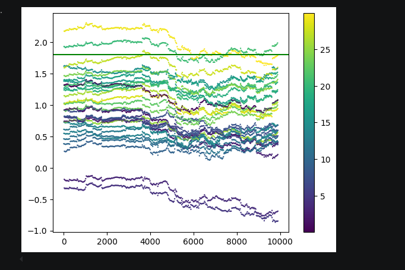
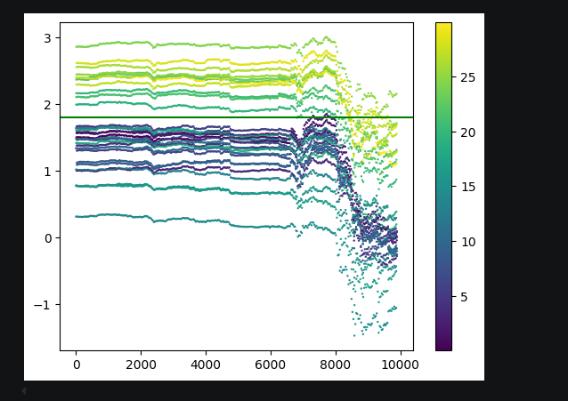
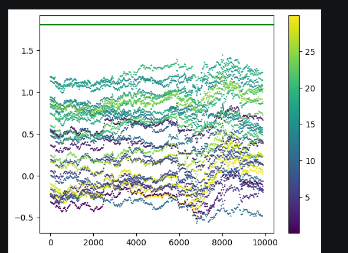
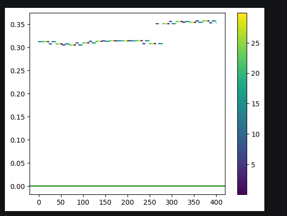
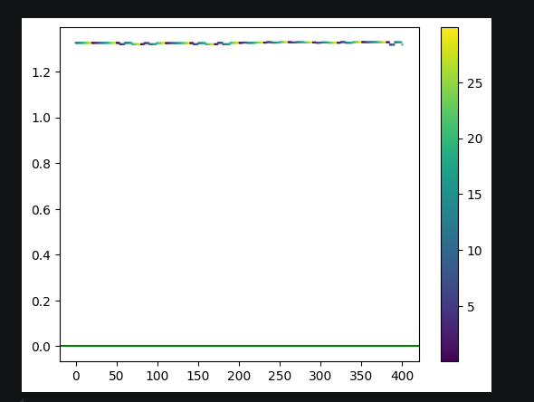
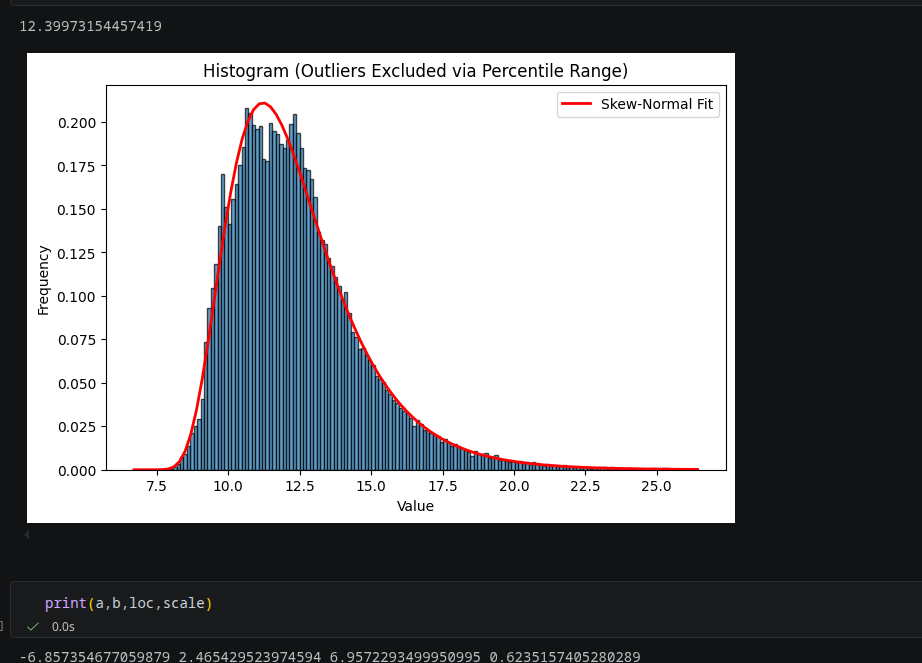

# Momentum Change  Predictive Trading Strategy

A basic, from-scratch quantitative trading strategy . This project implements a multi-model look-forward predictive matrix that balances short-term market momentum against an ensemble of long-term structural trends. The strategy operates without dependency on high-level machine learning frameworks, relying entirely on **NumPy** and **Pandas** for vectorized matrix calculations, volatility normalization, and execution tracking.

---

## Introduction & Experimental Evolution

This project began as an entry-level exploration into quant, focusing on a single asset to predict its future directional position from basic probability principles. Early optimization passes revealed that the strategy could be aggressively tuned to individual historical datasets by identifying the exact long-term lookback remainder ($T_l \pmod{30}$) that maximized backtested risk-adjusted returns. 

However, forward out-of-sample validation exposed a classic quantitative obstacle: a remarkably weak correlation between the optimal parameters found on historical data and their actual performance on future live data. 

To prevent overfitting and tame execution volatility, the strategy overhauled into a robust ensemble framework. By securing a structurally stable short lookback window ($T_s$) and evaluating a diverse spectrum of concurrent long lookback windows ($T_l$)(weighed by softmax of indicators) across an array of shifting look-forward time horizons ($t$) (weighed by decaying exponential), the system gained structural stability through model diversification.

### Current Performance Profile & Horizons
Multi-stock backtesting reveals highly regime-dependent performance profiles:
* **Asset Specificity:** The model delivers excellent, sustained risk-adjusted returns on specific equity structures, but encounters structural friction and fails on others where underlying structural drift assumptions break down.
* **Shorting Mechanics (-1):** While the current baseline operates on a long-only fractional scale [0.0, 1.0], experimental adjustments enabling two-sided short positions (-1) completely alter the strategy's equity curve topology. Allowing short entries sometimes dilutes alpha on historically optimal trending stocks, but significantly stabilizes and rehabilitates performance on failing assets.

Ultimately, this project serves as a deeply insightful mathematical experiment. While the predictive mechanics still possess significant scope for parameter refinement and structural optimization, building this system from the ground up provided invaluable practical exposure to data leakage prevention, statistical resonance, and vectorization design.

---

##  Strategy Architecture & Detailed Mathematical Derivation

The code attached uses average of difference weighted by lookback time to generate a signal using a formula.The derivation of the formula and conditions arise from some assumptions about the market and some basic principles of probability ,sepcifically estimation and concentration inequalitites.
The mathematical formulation and code explanation is detailed below.Following will also have  an analysis of the original strategy followed by the changes made to make is less volatile.Visualisations are available in the attached notebook and also in the pictures that would be attached.

# Strategy 1: Momentum-Based Signal Generation

We calculate a trading signal every \(t\) seconds and hold the resulting position until the next signal update.

---

## Derivation of the Signal

Assume that price differences are normally distributed random variables. Since averages of normal random variables are also normally distributed, we model the short- and long-window dynamics as

$$
\Delta x_{\text{long}}
\sim
\mathcal N(\mu_{\text{long}}, \sigma^2)
$$

$$
\Delta x_{\text{short}}
\sim
\mathcal N(\mu_{\text{short}}, \sigma^2)
$$

We place Gaussian priors on the unknown means:

$$
\mu_{\text{long}}
\sim
\mathcal N(0,\sigma_0^2)
$$

$$
\mu_{\text{short}}
\sim
\mathcal N(0,\sigma_0^2)
$$

Using the MAP estimate for the means, we obtain

$$ \hat{\mu}_{\text{long}} = \frac{\Delta X_L} {T_L+\frac{\sigma^2}{\sigma_0^2}}$$

$$ \hat{\mu}_{\text{short}}=\frac{\Delta X_S}{T_S+\frac{\sigma^2}{\sigma_0^2}} $$

where

$$\Delta X_L,\quad \Delta X_S$$

are the total price differences accumulated over the windows \(T_L\) and \(T_S\), respectively.

Define

$$\rho=\frac{\sigma^2}{\sigma_0^2}.$$

Then

$$\hat{\mu}_{\text{long}}
=\frac{\mu_L}{1+\frac{\rho}{T_L}}$$

and

$$\hat{\mu}_{\text{short}}=\frac{\mu_S}{1+\frac{\rho}{T_S}}.$$

Here, $$\(\mu_L\)$$ and $$\(\mu_S\)$$ denote the empirical averages over the long and short windows.

---

## Persistence of Momentum

Assume that the momentum observed in the short window remains unchanged.

Then the expected difference after \(t\) seconds is

$$
\frac{\mu_S t}
{1+\frac{\rho}{T_S}}.
$$

For the long window, the expected value after time \(t\) is

$$
\frac{\mu_L t}
{1+\frac{\rho}{T_L}}.
$$

Hence

$$
\Delta X_{\text{long}}
\sim
\mathcal N
\left(
\frac{\mu_L t}
{1+\frac{\rho}{T_L}},
\
t\sigma^2
\right).
$$

---

## Regime Change Criterion

We impose the condition

$$\Pr\left(\Delta X_{\text{long}}>\frac{\mu_S t}{1+\frac{\rho}{T_S}}\right)<\varepsilon.$$

This leads to the estimate

$$t>\frac{-2\sigma^2\ln(\varepsilon)}{\left(\frac{\mu_L}{1+\frac{\rho}{T_L}}-\frac{\mu_S}{1+\frac{\rho}{T_S}}\right)^2}=T.$$

Interpretation:

If the current regime persists for more than \(T\) minutes, then the probability that the same momentum continues becomes less than $$\varepsilon\$$. At this point, a regime shift is assumed to be more likely.

---

## Expected Return After a Regime Shift

After the estimated shift time \(T\), the expected drift is modeled as a mixture of the short- and long-window estimates:

$$
\varepsilon
\frac{\mu_S}
{1+\frac{\rho}{T_S}}
+
(1-\varepsilon)
\frac{\mu_L}
{1+\frac{\rho}{T_L}}.
$$

For a forecasting horizon \(t\):

### Case 1: \(T < t\)

$$E(\Delta X)=T
\left(
\frac{\mu_S}
{1+\frac{\rho}{T_S}}
\right)
+
(t-T)
\left(
\varepsilon
\frac{\mu_S}
{1+\frac{\rho}{T_S}}
+
(1-\varepsilon)
\frac{\mu_L}
{1+\frac{\rho}{T_L}}
\right).
$$

### Case 2: $$\(T \ge t\)$$

$$E(\Delta X)=t\left(\frac{\mu_S}{1+\frac{\rho}{T_S}}\right).$$

The quantity $$E(\Delta X)\$$ serves as the primary indicator.

---

## Signal Construction

### Continuous Signal

A smooth signal can be generated using a sigmoid transformation:

$$\text{Signal}=
\frac{1}
{1+e^{-E(\Delta X)}}.
$$

### Discrete Signal

Alternatively,

$$\text{Signal}=
\begin{cases}
0, & |E(\Delta X)| < 0.001 \\
1, & E(\Delta X) > 0.001 \\
-1, & E(\Delta X) < -0.001
\end{cases}
$$

---

# Modified Strategy

To reduce sensitivity to a single parameter choice, the signal is evaluated over a range of long-window lengths and forecasting horizons.

Rows correspond to different values of T_L\, while columns correspond to different values of t\.

The signal matrix is

$$
A=
\begin{bmatrix}
S(T_L,t) & S(T_{L+1},t) & \cdots & S(T_{L+15},t) \\
S(T_L,t+1) & S(T_{L+1},t+1) & \cdots & S(T_{L+15},t+1) \\
\vdots & \vdots & \ddots & \vdots \\
S(T_L,t+30) & S(T_{L+1},t+30) & \cdots & S(T_{L+15},t+30)
\end{bmatrix}
$$

Similarly, define the indicator matrix

$$
I_n=
\begin{bmatrix}
\text{Ind}(T_L,t) & \cdots & \text{Ind}(T_{L+15},t) \\
\text{Ind}(T_L,t+1) & \cdots & \text{Ind}(T_{L+15},t+1) \\
\vdots & \ddots & \vdots \\
\text{Ind}(T_L,t+30) & \cdots & \text{Ind}(T_{L+15},t+30)
\end{bmatrix}
$$

where

$$
\text{Ind}(T_L,t)=E(\Delta X).
$$

---

## Aggregated Signal

The final signal at t+30 is computed as

$$\text{Signal}=
\sum_{i=0}^{30}
e^{-i\lambda}
\sum_{j=0}^{15}
A[i,j]\,w_{ij}.
$$

The weights are determined using a softmax transformation of the indicators:

$$w_{ij}=
\frac{
\Phi(I_n[i])_j
}{
\sum_{k=0}^{15}
\Phi(I_n[i])_k
}.
$$

---

## Motivation

This modification reduces dependence on any single parameter choice. Instead of relying on a fixed long-window length or forecast horizon, the strategy aggregates information across a family of parameter settings and assigns larger weights to configurations with stronger indicator values.

This produces a more robust signal that is less sensitive to local parameter choices and potentially more adaptive to changing market conditions.

## 📊 Empirical Analysis & Parameter Topology

### 1. Cyclostationary Parameter Resonance (Modulo Stride)
A deeper exploration of the parameter landscape revealed an architectural phenomenon: **cyclostationary parameter resonance** driven by the strategy's update stride interval (**T = 30** minutes).

By holding the short lookback window ($T_s$) static and systematically permuting the long lookback window ($T_l$) across wide integer ranges, the resulting annualized Sharpe Ratios were tracked, mapped, and grouped. All $T_l$ configuration paths sharing a matching remainder when divided by the stride interval ($T_l \pmod{30}$) create tightly clustered, stratified risk-adjusted return bands. Empirically, **higher modulo remainders yield significantly elevated Sharpe ratio profiles**, indicating optimized phase alignment with the structural market rebalancing cycles.

Attached are some graphs visualising this.The Y axis has annualised sharpe ratio and X axis has values of Tl ,each point in scatter plot has been colour coded ,with values having same remainder when divided by 30 having same colout,the colour bar shown beside,and the correlation is clearly visible,illustrating the cyclostationary behaviour in the initial strategy.

#### Strategy 1

In order to reduce the parameter rigidity and make it more robust,we take several Tl values and weight calculated signal with softmax weights of underlying indicators.ALong with that we take several periods of prediction t and weight them with decaying exponential weight.With small number of parameters (only some ranges value scan take ) the graphs look like this.

#### Strategy 2
    

It is clear that the sharpe value takes a more stable value(lesser than maximum possible in strategy 1) acheivable for wide range of parameters and the lines in upper graphs seem to converge together to their weighted sums.

Another analysis of various Ts and Tl making a heatmap showed that for a fixed Tl that can give some ideal sharpe,all values of Ts remain relatively close,so any reasonable Ts would be fine,and we need to optimise or take weighted average over Tl.Changing t also lead to different sharpes ,so modification was made to have calculated value influencing multiple future values weighed by exponential decay. 

### 2. Signal Activation Topology (Sigmoid vs. Signum)
The structural formation of these parameter bands depends heavily on the mathematical activation functions used to scale raw directional conviction:

* **Continuous Sigmoid Transformation ($f(x) = \frac{1}{1 + e^{-x}}$):** Compresses variance across phase offsets. By smoothing the gradient boundaries of underlying model transitions, the performance profiles of differing modulo remainder cohorts are pulled closely together into a dense, upward-trending performance channel.
* **Discrete Signum Transformation ( $f(x) = \text{sgn}(x)$ ):** Strips away continuous gradient scaling and isolates raw binary directional conviction. This choice amplifies the structural phase delays among parameter pairs, splitting the parameter resonance wide open into independent, horizontally stratified performance bands.

### 3. Log-Space Momentum Transition Distribution
Tracking the temporal properties of the strategy reveals that the intervals between predicted trend transition turning points ($\Delta \tau = \tau_{k+1} - \tau_k$) follow a highly specific geometric distribution.

When the transformation is mapped into natural log space $\ln(\Delta \tau)$, the probability density function (PDF) resolves into a **Jonhson Distribution** whose parameters can be observed:

$$f(x) = \frac{\delta}{\lambda \sqrt{2\pi}} \frac{1}{\sqrt{1 + \left(\frac{x-\xi}{\lambda}\right)^2}} \exp\left[ -\frac{1}{2} \left( \gamma + \delta \sinh^{-1}\left(\frac{x-\xi}{\lambda} \right) \right)^2 \right]$$

> **Structural Insight:** The clean  profile in log space proves that market regime durations are fundamentally asymmetric. The sharp, bounded left tail establishes a clear physical limit on minimum regime velocity (preventing rapid, high-frequency signal whip-sawing). Conversely, the elongated, heavy right tail mathematically accounts for rare, highly stable macroeconomic trends that persist exponentially longer than traditional symmetric gaussian models assume.

---

## Further scope of analysis
Further analysis can be done as to why the time series follows such a distribution or why the sharpe ratio follows such a cyclic trend.The period of 30 itself might be dependent heavily on rest of the parameters like short window ,threshold etc.A mathematical derivation aside from the intuitive explanation is needed.

---
## Conclusion
This was a beginer project where I had great fun devising  a strategy mathematically , implementing it and devising modifications to strategy based on intial testing ,avoiding any form of look ahead bias or data leakage.
The starting versions of code were written from scratch , and vectorised versions which followed the same strategy but greatly optimised time complexity were vibecoded .
Overall I had great fun developing it and learned some new things.I hope to develop much more in the world of quantative trading applying more complex strategies (using more features ,multiple assets etc).
